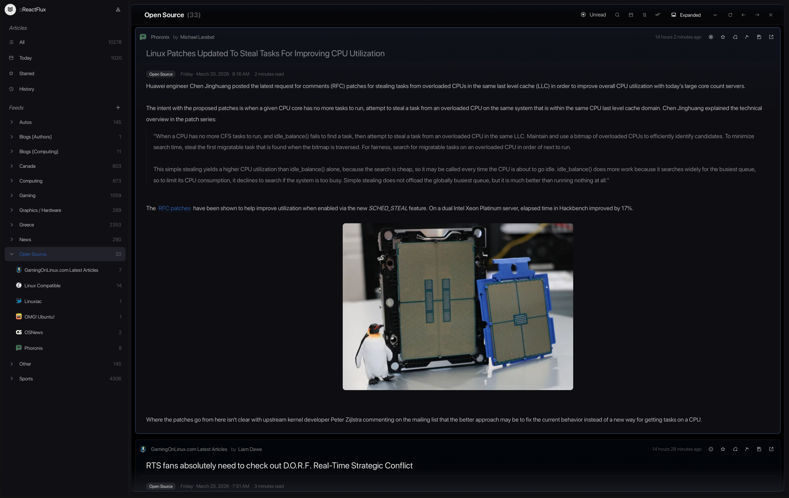
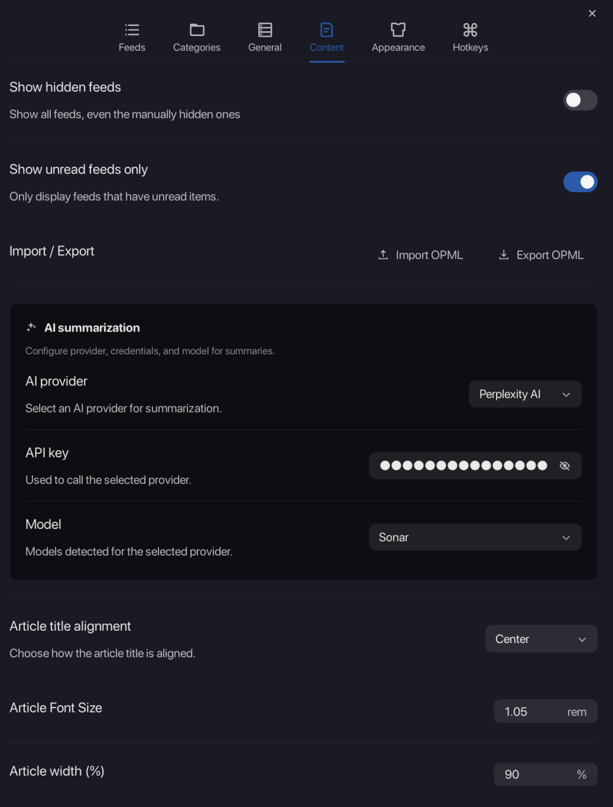
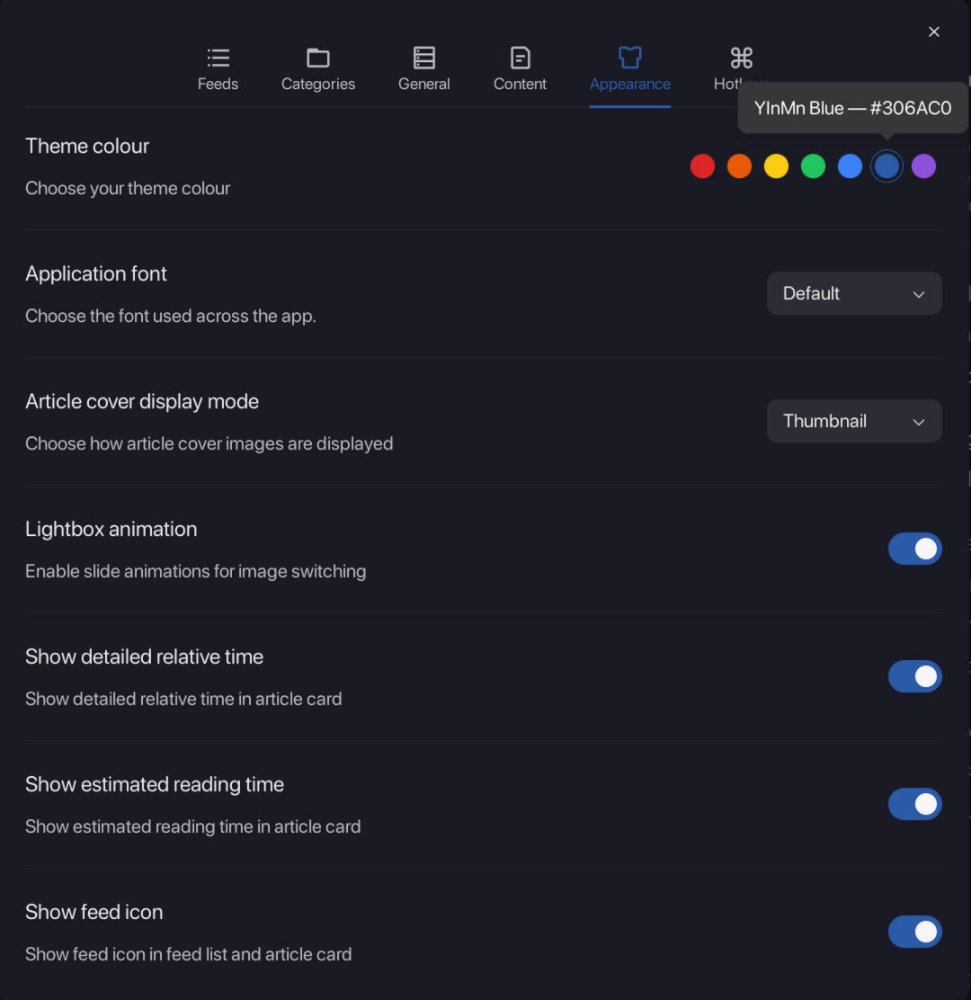
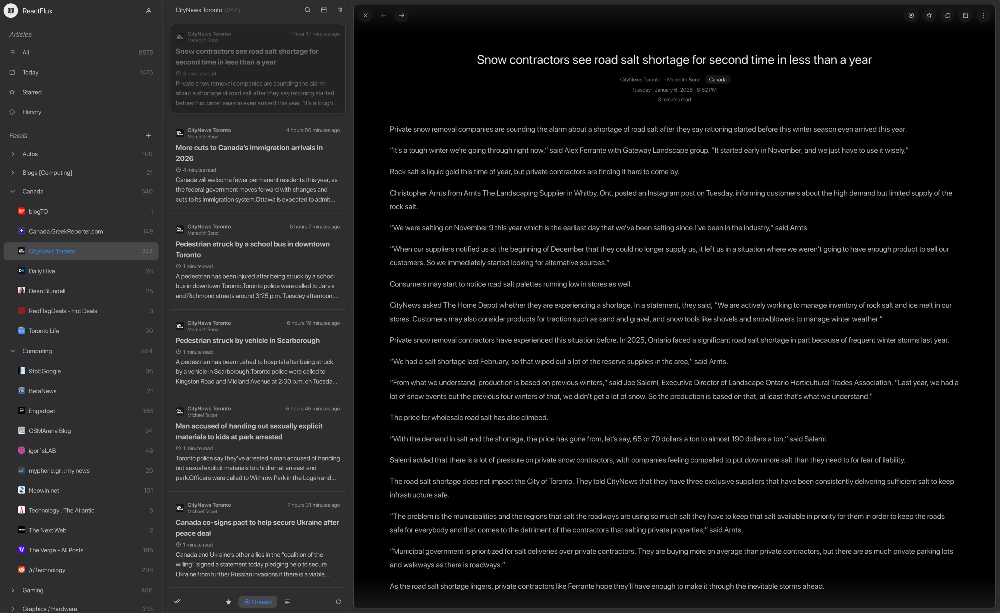

# A few words about this fork

> [!IMPORTANT]  
> Used various LLMs as a playground for code generation and assistance in forking/structuring/coding the project.

This fork was created to add some stuff that I was sorely missing from the original excellent work the ReactFlux devs had already done. It now continues as ReloadedFlux, with additions such as:

- New layout option with a left sidebar for feeds and categories, and a right sidebar for article content. The original layout is still available as an option.
  

- Resizable panes
- Mark as read functionality based on days
  

- AI Summarization of articles
- New Content section contains old feed + article three dot menu options, plus new colour and global font setting for the whole app.
  
  

- Some theme changes I was applying with Tampermonkey up until now.
  

- Some other stuff as well (Greek localization support, clicking on feeds/categories always refreshes the feed, etc.)

This fork is my daily driver but it is bound to have bugs, so the usual apply; use at your own peril etc. For more info about the original project lineage, go read the upstream README contents from electh/ReactFlux:main.
